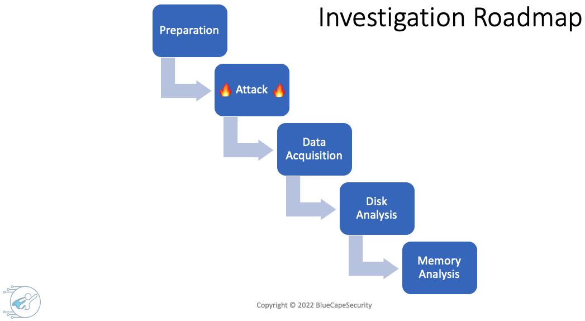

# Practical Windows Forensics

*A quick DIY purple teaming approach for preparing a Windows system with realistic attack patterns, which can then be used as a specimen to perform a digital forensic investigation of the VM*

*Steps TLDR:*
* Prepare a Windows target VM
* Execute attack script (based on the AtomicRedTeam framework) on target VM
* Acquire memory and disk images 
* Setup a Windows forensic VM
* Get started with your Windows forensic analysis

Prerequisites:
  * VirtualBox or VMWare hypervisor. See: https://bluecapesecurity.com/build-your-lab/virtualization/
  * Host system requirements: 
      * Enough RAM for running a Windows VM with 4GB RAM (There are two VMs, but they do not have to run at the same time)
      * Enough disk storage for 2 x Windows VMs using about 40GB each. Additionally, you'll need around twice the amount for handling disk images, memory images and additional files. Having 100GB+ storage available will be ideal. 

## Investigation Roadmap

## Attack Scenario
The attack script in this repo can be used to create a realistic compromise scenario on a Windows system. It leverages selected Atomic Red Team tests that simulate commonly observed techniques in real world attacks. The script `PWF/AtomicRedTeam/ART-attack.ps1` first installs [Invoke-AtomicRedTeam](https://github.com/redcanaryco/invoke-atomicredteam) and then executes a number of techniques. The techniques executed in this script are highlited the MITRE ATT&CK framwork below.

## Preparation
### 1 Prepare Target System
1.1) Download, import and configure the free Windows 10 test VM from the Microsoft developer site
  * Download: https://developer.microsoft.com/en-us/microsoft-edge/tools/vms/
  * Import into VirtualBox and **take a snapshot before the first start**. This allows rolling back after the attack or the VM expired.
  * Start and log in to the VM. Credentials: "IEUser" and "Passw0rd!"
  * **Pause Windows Updates** to avoid additional noise: Go to Settings -> Windows Update -> Advanced Options -> Pause updates
  * **Install Sysmon** for detailed event logging.
      * Download the script in `PWF/Install-Sysmon/Install-Sysmon.ps1` onto the system
      * Run PowerShell **as administrator**, navigate to the script and execute it `.\Install-Sysmon.ps1`
  * **Disable all Defender settings**: Before executing the attack, go to "Virus & threat protection settings" -> Manage settings -> Disable all the features shown. *Note that this is only a temporary solution and real-time protection will turn itself on automatically after a while*.

1.2) Execute the attack script on the target system
* Download the script in `PWF/AtomicRedTeam/ART-attack.ps1` onto the system
* Run PowerShell **as administrator!**, navigate to the script and :fire: *execute it* :fire: `.\ART-attack.ps1`
    * Ensure that the target VM has internet access as it will download the Invoke-AtomicRedTeam Framework. Furthermore, press [Y] Yes if PowerShell asks for installing additional features.
    * Verify that the powershell logs show successful executions of atomics. (If unsuccessful shut down the VM, revert to the previous snapshot and implement fixes before running the script again.)
    * Do **not close any windows or processes** and proceed to the next step!

### 2 Disk and Memory - Data Acquisition 
2.1) Pause the VM and take a snapshot

2.2) Take an image of the VM memory
* Create an "evidence" folder on the host system to store the following disk and memory images.

*VMWare memory acquisition*
  - Open the *.vmwarevm* directory of the VM in a terminal
  - Copy the .vmem file your evidence folder

*VirtualBox memory acquisition*
* Open your terminal (Mac/Linux) or cmd (Windows) to run *vboxmanage* (in Windows it is located under C:\Program Files\Oracle\VirtualBox)
* Identify the VM's UUID: `vboxmanage list vms`
* Create a snapshot of the VM's memory: `vboxmanage debugvm <VM_UUID> dumpvmcore --filename win10-mem.raw`
  
2.3) Take an image of the VM disk

*VMWare disk image acquisition* 
* Locate the VMDK split files in the VM's directory. These are all files ending with *.vmdk*.
    * Depending on the number of snapshots there could be several versions of VMDK file sequences. In that case the sequence with the highest number in the name will be the one with the latest status e.g. as in "Virtual Disk-XXX.vmdk"
* Export the vmdk image. There are two options:
    * Copy all the split files of the latest sequence "Virtual Disk-xxx.vmdk" to "Virtual Disk-xxx-s0016.vmdk" into your evidence folder. 
    * Alternatively, create a single VMDK from split files: `C:\Program Files (x86)\VMware\VMware Player\vmware-vdiskmanager.exe» -r «d:\VMLinux\vmdkname.vmdk» -t 0 MyNewImage.vmdk`
  
*VirtualBox disk image acquisition*
* Open terminal or cmd
* Identify the VM's UUID: `vboxmanage list vms`
* Identify the VM's disk UUID: `vboxmanage showvminfo <VM_UUID>` Note the UUID of the disk in row *IDE Controller*
* Export the disk using the disk UUID into RAW format: `vboxmanage clonemedium disk <disk_UUID> --format raw win10-disk.raw`
  
2.4) Validate integrity of memory and disk images by creating SHA1 hashes and saving them in a text file along with the images.
  
*Windows*: Open PowerShell and navigate to the folder. Obtain hashes by executing: `Get-FileHash -Algorithm SHA1 <file>`
 
*Mac/Linux*: Open terminal and navigate to the folder. Obtain hashes by executing: `shasum <file>`
  
## Forensic Analysis

### 3 Set up Your Forensic Workstation
3.1) Set up a forensic VM as outlined in the following link: https://bluecapesecurity.com/build-your-forensic-workstation/
* It is recommended to install a Windows 2019 Server VM from the Microsoft Evaluation Center.
    * Create a new VM in Virtualbox. Assign at least **4 GB of RAM and 80 GB of disk storage with the dynamically allocated option** selected. This means the disk will start small (e.g. basic size of Windows 10-20 GB in size) and grows as we add more data. 
    * Install VirtualBox Guest Additions and enable shared clipboard and file sharing with the evidence folder on the host system.
    * When the Windows system is installed, follow the instructions in the section "Configure the Windows Environment – DFIR Best Practices".
* When the setup is complete, install the following tools: 
    * Kali Linux subsystem, Volatility
    * Arsenal Image Mounter, FTK Imager, Eric Zimmerman Tools, RegRipper, EventLog Explorer, Notepad++
* Take a snapshot once the setup is complete. 

### 4 Forensic memory and disk analysis
With the forensic workstation installed and the evidence created, we can now beginn with the analysis of the memory and disk images. If you need guidance on digital forensic analysis of Windows systems, feel free to check out the resources below:

*Early access to the courses and mentoring may be available to the right candidates. Check out and subscribe at [BlueCapeSecurity](https://www.bluecapesecurity.com).*

:fire:**The full course is currently under development**:fire:

Happy forensicating!

  
Copyright © 2022 [BlueCapeSecurity](https://www.bluecapesecurity.com)
  
