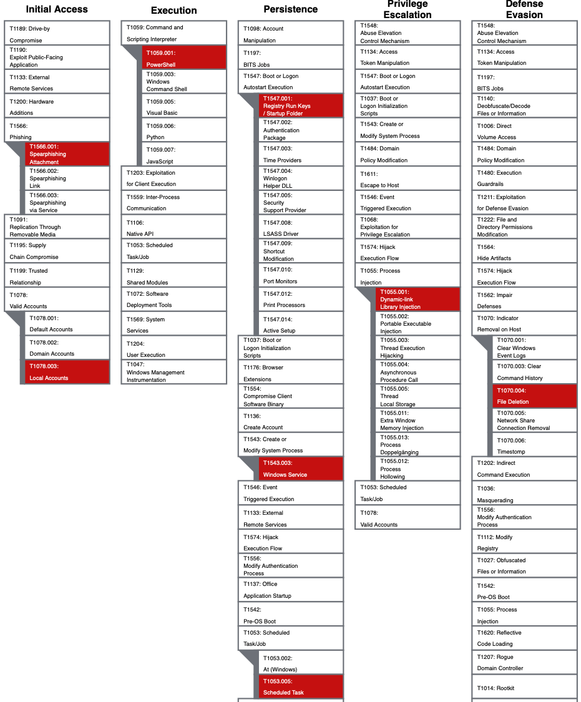

# Practical Windows Forensics

*The DIY purple teaming approach for learning digital forensics on Windows systems*

The purpose of this repo is to provide a quick solution to create a realistic attack scenario on a Windows system and getting everything set up for performing forensic analysis. You'll start with setting up a taret system and running the attack script on it, which leverages the [Atomic Red Team Framework](https://github.com/redcanaryco/atomic-red-team) to simulate realistic attack techniques. Following, the guide describes steps for acquiring memory and disk images of the compromised VM for VirtualBox and VMWare hypervisors. Finally, it discusses best practices for setting up an effective forensic workstation, based on Windows and a Linux subsytem, to perform forensic analysis on the evidence created from the compromised system.

Prerequisites:
  * VirtualBox or VMWare hypervisor. See: https://bluecapesecurity.com/build-your-lab/virtualization/
  * Host system: 
      * Enough RAM for running 2 x Windows 10 VMs with 4GB RAM each (this does not have to be at the same time)
      * Enough disk storage for 2 x Windows 10 VMs using about 40 GB each. Additionally, you'll need roughly around twice the amount for handling disk images, memory images and additional artifacts. 100GB+ free space altogether is ideal. 

### Attack Scenario
The attack script in this repo can be used to create a realistic compromise scenario on a Windows system. It leverages selected Atomic Red Team tests that simulate commonly observed techniques in real world attacks. The script `PWF/AtomicRedTeam/ART-attack.ps1` first installs [Invoke-AtomicRedTeam](https://github.com/redcanaryco/invoke-atomicredteam) and then executes a number of techniques. The techniques executed in this script are highlited the MITRE ATT&CK framwork below.

## Preparation
### Prepare Target System
1) Download, import and configure the free Windows 10 test VM from the Microsoft developer site
  * Download: https://developer.microsoft.com/en-us/microsoft-edge/tools/vms/
  * Import into VirtualBox and **take a snapshot before the first start**. This allows rolling back after the attack or the VM expired.
  * Start and log in to the VM. Credentials: "IEUser" and "Passw0rd!"
  * Pause Windows Updates to avoid additional noise: Go to Settings -> Windows Update -> Advanced Options -> Pause updates
  * Install Sysmon for detailed event logging.
      * Download Sysmon: https://docs.microsoft.com/en-us/sysinternals/downloads/sysmon
      * Download Sysmon config script: https://github.com/SwiftOnSecurity/sysmon-config/blob/master/sysmonconfig-export.xml
      * Install Sysmon: Open cmd as administrator and run `sysmon64 -i sysmonconfig-export.xml`
  * **Disable all Defender settings**: Before executing the attack, go to "Virus & threat protection settings" -> Manage settings -> Disable all the features

2) Execute the attack script on the target system
* Download the script in `PWF/AtomicRedTeam/ART-attack.ps1` onto the system
* Run PowerShell **as administrator!**, navigate to the script and :fire: *execute it* :fire:. 
    * Ensure that the target VM has internet access as it will download the Invoke-AtomicRedTeam Framework. Furthermore, press [Y] Yes if PowerShell asks for installing additional features.
    * Verify that the powershell logs show successful executions of atomics. (If unsuccessful shut down the VM, revert to the previous snapshot and implement fixes before running the script again.)
    * Do **not close any windows or processes** and proceed to the next step!

### Disk and Memory - Data Acquisition 
3) Take an image of the VM memory
* Create an "evidence" folder on the host system to store the following disk and memory images.
* In your hypervisor suspend or pause the VM

*VMWare memory acquisition*
  - Open the *.vmwarevm* directory of the VM in a terminal
  - Copy the .vmem file your evidence folder

*VirtualBox memory acquisition*
* Open your terminal (Mac/Linux) or cmd (Windows) to run *vboxmanage* (in Windows it is located under C:\Program Files\Oracle\VirtualBox)
* Identify the VM's UUID: `vboxmanage list vms`
* Create a snapshot of the VM's memory: `vboxmanage debugvm <VM_UUID> dumpvmcore --filename win10-mem.raw`
  
4) Take an image of the VM disk
* Unpause / Resume the VM
* Shutdown the Windows VM (this ensures updates from memory are written to the  system)

*VMWare disk image acquisition* 
* Locate the VMDK split files in the VM's directory. These are all files ending with *.vmdk*.
    * Depending on the number of snapshots there could be several versions of VMDK file sequences. In that case the sequence with the highest number in the name will be the one with the latest status e.g. as in "Virtual Disk-XXX.vmdk"
* Export the vmdk image. There are two options:
    * Copy all the split files of the latest sequence "Virtual Disk-xxx.vmdk" to "Virtual Disk-xxx-s0016.vmdk" into your evidence folder. 
    * Alternatively, create a single VMDK from split files: `C:\Program Files (x86)\VMware\VMware Player\vmware-vdiskmanager.exe» -r «d:\VMLinux\vmdkname.vmdk» -t 0 MyNewImage.vmdk`
  
*VirtualBox disk image acquisition*
* Open terminal or cmd
* Identify the VM's UUID: `vboxmanage list vms`
* Identify the VM's disk UUID: `vboxmanage showvminfo <VM_UUID>` Note the UUID of the disk in row *IDE Controller*
* Export the disk using the disk UUID into RAW format: `vboxmanage clonemedium disk <disk_UUID> --format raw win10-disk.raw`
  
5) Validate integrity of memory and disk images by creating SHA1 hashes and saving them in a text file along with the images.
  
*Windows*: Open PowerShell and navigate to the folder. Obtain hashes by executing: `Get-FileHash -Algorithm SHA1 <file>`
 
*Mac/Linux*: Open terminal and navigate to the folder. Obtain hashes by executing: `shasum <file>`
  
### Set up Your Forensic Workstation
6) Set up a forensic VM as outlined in the following link: https://bluecapesecurity.com/build-your-forensic-workstation/
* It is recommended to install a Windows 2019 Server VM from the Microsoft Evaluation Center.
    * Create a new VM in Virtualbox. Assign at least **4 GB of RAM and 80 GB of disk storage with the dynamically allocated option** selected. This means the disk will start small (e.g. basic size of Windows 10-20 GB in size) and grows as we add more data. 
    * Install VirtualBox Guest Additions and enable shared clipboard and file sharing with the evidence folder on the host system.
    * When the Windows system is installed, follow the instructions in the section "Configure the Windows Environment – DFIR Best Practices".
* When the setup is complete, install the following tools: 
    * Kali Linux subsystem, Volatility
    * Arsenal Image Mounter, FTK Imager, Eric Zimmerman Tools, RegRipper, EventLog Explorer, Notepad++
* Take a snapshot once the setup is complete. 

## Forensic Analysis

With the forensic workstation installed and the evidence created, we can now beginn with the analysis of the memory and disk images. 

:fire:**The full course is currently under development**:fire:

*Early access to the course and mentoring may be available to the right candidates. Check out and subscribe at [BlueCapeSecurity](https://www.bluecapesecurity.com).*

Happy forensicating!

  
Copyright © 2022 [BlueCapeSecurity](https://www.bluecapesecurity.com)
  
